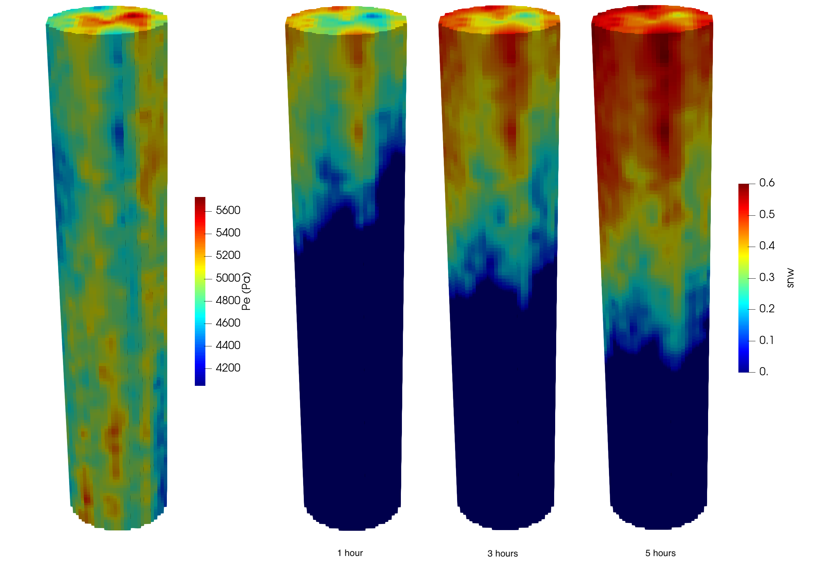

finch
=====

finch is a [MOOSE](https://mooseframework.org)-based application for modelling advective flows in heterogeneous porous media using the finite volume method.


*Example of drainage simulation in heterogeneous 3D core*

### Get finch

The first step in using finch is to get and install [MOOSE](https://mooseframework.inl.gov/getting_started/installation/index.html) - follow the detailed instructions on the [MOOSE](https://mooseframework.inl.gov/getting_started/installation/index.html) website.

Once you have a working MOOSE installation, then you can clone finch
```bash
git clone git@github.com:cpgr/finch.git
```
or
```bash
git clone https://github.com/cpgr/finch.git
```

The next step is to build finch
or
```bash
cd finch
make -j<n>
```
where `<n>` is the number of cores available for parallel compilation.

If finch compiles successfully, you can test that everything is working correctly by running the test suite
```bash
./run_tests -j<n>
```

Each of the tests in the `test/tests` folder are valid finch input files that provide examples of using finch.

In addition, benchmarking examples are provided in the `benchmarks` folder, and examples of more complex models are provided in the `examples` folder.

Any questions, feel free to contact the developers or raise an issue on the finch GitHub page.

### Contributors

finch has been developed by
- Chris Green, CSIRO ([cpgr](https://github.com/cpgr))
- Sam Jackson, CSIRO ([sci-sjj](https://github.com/csi-sjj))

New contributions are welcome, using the pull request feature of GitHub.

### Feature requests/ bug reports

Any feature requests or bug reports should be made using the issues feature of GitHub. Pull requests are always welcome!
